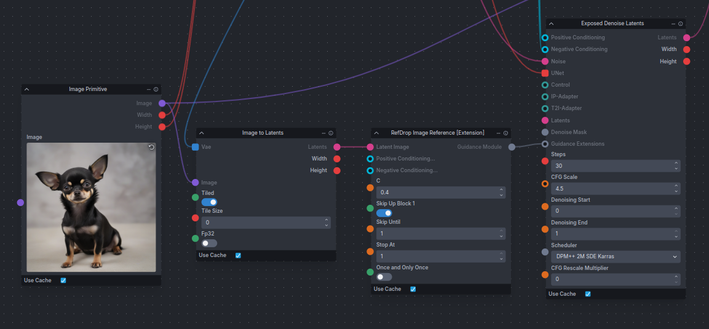

# Modular Denoise Latents
This node pack originally provided injection points in a Denoise Latents Node in order to modify the noise prediction process. This functionality has since been built into the core Invoke nodes, but it is not exposed to users without setting an environment variable. To get around this, I provide an Exposed Denoise Latents node with an extra input and handling for extensions.

Please Note: I am not the original designer for most of these noise prediction methods. This is the work of talented and knowledgeable people. I am simply porting their discoveries into an architecture that lets me more easily manipulate and experiment with them.  

IMPORTANT: Many things will be frequently broken in this repo. I will try to keep old code archived somewhere so it can be more easily updated and reintroduced to new versions, but I frequently scrap everything that works and build new things.  

## RefDrop - 50% of the time, it works all the time!  (SDXL only so far)
RefDrop uses some internal attention mixing to make an output include features from an input picture.  
Below is an example when given the prompt `a chihuahua on a log` and the reference image, compared to the normal output for chihuahuas (which are nearly always white with this model).  

The setup for creating that image is straightforward:  

### The settings are as follows:  
- **Latent**: Reference image converted through VAE. This can be generated or from another source. Should be scaled to match the dimensions of the output.
- **Conditionings (OPTIONAL)**: If both conditionings are supplied, the attention swapping will use them for the reference attention instead of the main conditionings. If either one is missing, it will default back to the main conditionings for positive and negative. Whatever is in these conditionings also affects the generation in odd ways in the context of the reference image. Sometimes it is helpful to have them different from the main prompt. 
- **C**: This is the strength value for the extension. Usually 0.2-0.4 range. More complex subjects might require higher numbers. A value of 0 will not apply any attention sharing and will create an output identical to the default output. A value of 1 will make your dogs look like they've been in an accident.
- **Skip Up Block 1**: Enabling this helps prevent the pose/layout of the reference image from strongly affecting the output, at the expense of not matching the reference as well.
- **Skip Until**: If this value is less than 1 and SUPB1 is enabled, then Up Block 1 will no longer be skipped after that far into the denoise; e.g. a value of 0.50 will re-enable Up Block 1 50% of the way through the process, hopefully to improve quality after the layout has been determined.
- **Stop At**: End the influence of the extension early. **This actually doesn't work right now**, probably just leave it at 1 unles you have also enabled...
- **Once And Only Once**: Instead of computing shared attention every step, only compute it once for the final step (based on Stop At value) and just reuse that over and over again. **Much faster generation time**. Lower quality.  

Enabling **Once And Only Once** seems like it should give terrible results, but it's actually not that bad:
